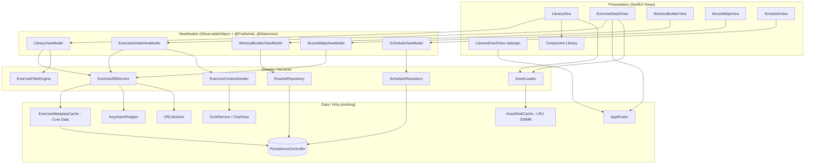
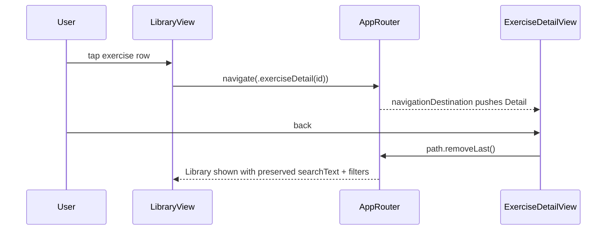
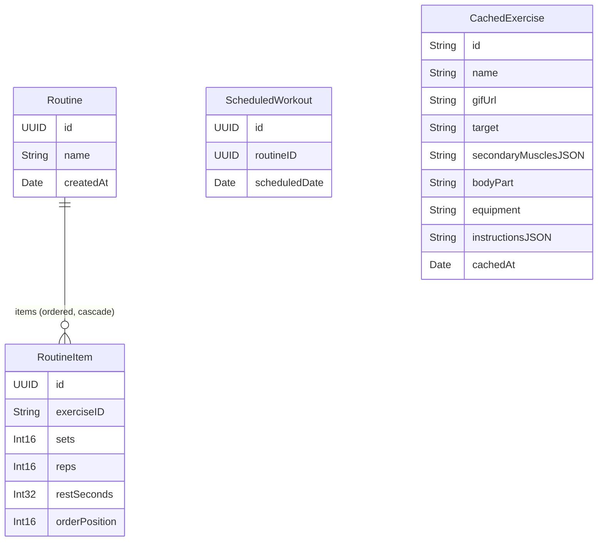

# Design Document — App Redesign & ExerciseDB Hub

## Overview

Dokumen desain ini menjabarkan implementasi redesign UI/UX skala besar pada aplikasi iOS **PULSE — AI Fitness Coach** sekaligus penambahan kapabilitas baru bertenaga **ExerciseDB**: Exercise Library/Explorer, Enriched Exercise Detail, Workout Builder, Muscle Map/Body Heatmap, Scheduling, integrasi AI Coach ke alur baru, serta redesign visual layar kamera.

Prinsip pemandu desain:

1. **Tidak ada perubahan warna merek.** Seluruh `Brand_Palette` (`themePrimary` #FC4C02, `themeSecondary`, `themeAccent`, `themeBackground` pure-black, `brandGradient`, `coachGradient`) dipakai persis seperti yang sudah ada di `Core/Extensions/Color+Theme.swift`. Redesign hanya menyentuh layout, hierarki, komponen, motion, dan polish.
2. **Token-only styling.** Tidak ada hex, spacing, atau corner radius yang di-hardcode di view. Semua mengacu pada `Design_System` (semantic `Color`, `CGFloat.spacing*`, `CGFloat.cornerRadius*`).
3. **Reuse, bukan duplikasi.** AI Coach memakai `GLMService`/`ChatView` yang ada; kamera mempertahankan seluruh logika deteksi yang ada; loading/empty memakai `SkeletonLoader`/`EmptyStateView`; persistensi memakai `PersistenceController`; kredensial memakai `KeychainWrapper`.
4. **iOS 16.4 / Swift 5.7 / SwiftUI saja.** `NavigationStack` + `navigationDestination(for:)`, `@StateObject`/`ObservableObject` + `@Published`, satu ViewModel per layar, Core Data (bukan SwiftData), tanpa API iOS 17+, tanpa `AnyView` (pakai `@ViewBuilder`).

### Catatan grounding terhadap codebase yang ada

| Aspek | Temuan di codebase | Implikasi desain |
|------|--------------------|------------------|
| Design tokens | `BrandTokens`, semantic `Color`, `.spacingSmall/Medium/Large/ExtraLarge` (4/8/16/24), `.cornerRadiusSmall/Large/ExtraLarge` (12/20/28) | Component_Library dibangun langsung di atas token ini |
| Router | `AppRouter: @MainActor ObservableObject` dengan `selectedTab`, `showCamera`, `pendingExercise: ExerciseType?`, `handleDeepLink(_:)`, `openCamera(with:)` | Ditambah `path: [AppRoute]` untuk push baru tanpa menghapus rute lama |
| Persistensi | `PersistenceController` `NSPersistentContainer(name: "FitnessApp")`, model NSManagedObject subclass manual + extension factory/fetch | Entity baru ditambahkan ke model `FitnessApp.xcdatamodeld` dan diberi file `*+CoreData.swift` mengikuti pola `WorkoutLog+CoreData.swift` |
| Keychain | `KeychainWrapper.save/load/delete(key:)` | Kredensial ExerciseDB disimpan dengan key khusus |
| AI Coach | File `GLMService.swift` berisi `DeepSeekService` (REST OpenAI-compatible); `ChatViewModel` merakit system prompt via `ContextBuilder`; `ChatView` menerima `onCameraRequested` | Injeksi konteks lewat mekanisme seed prompt baru, layanan tidak digandakan |
| Kamera | `ExerciseType` enum (jumpingJacks, squats, highKnees, armRaises, toeTouches); `CameraViewModel` membaca `router.pendingExercise`; deteksi di `ExerciseDetector`/`SquatRepCounter`/`FlexFitClassifierManager` | Hanya overlay yang diredesain; pipeline deteksi tidak disentuh |
| UI helpers | `SkeletonLoader(cornerRadius:)`, `EmptyStateView(icon:title:message:cta:)` | Dipakai ulang untuk Async_State loading/empty |

> Catatan: requirement menyebut "GLMService"; pada codebase, file `GLMService.swift` secara konkret berisi `DeepSeekService`. Desain ini memperlakukan keduanya sebagai layanan chat tunggal yang ada dan TIDAK menggandakannya.

---

## Architecture

### Layering high-level



### Prinsip aliran data

- **Satu arah & off-main-thread:** ViewModel memanggil service `async/throws`. Networking dan dekode gambar dijalankan di luar main thread; hanya update `@Published` yang dilakukan di main thread (semua ViewModel `@MainActor`, kerja berat di `Task.detached`/background context/`URLSession`).
- **Async_State terpusat:** setiap ViewModel berbasis-data mengekspos satu `@Published private(set) var state: AsyncState<T>` yang nilainya tepat salah satu dari `loading/loaded/empty/error` (Requirement 19).
- **Cache-first:** `ExerciseDBService` selalu mengecek `Exercise_Cache` (metadata + aset) sebelum jaringan, sesuai TTL dan kondisi offline (Requirement 5, 6).
- **Repository untuk Core Data:** `RoutineRepository` dan `ScheduleRepository` membungkus operasi Core Data (create/update/delete/fetch) menggunakan background context untuk tulis dan `viewContext` untuk baca, mengikuti pola `WorkoutLog+CoreData.swift`.

### Struktur folder baru (mengikuti konvensi `Features/` & `Core/`)

```
Core/
  DesignSystem/                 # Component_Library (baru)
    PulseCard.swift
    FilterChip.swift
    PrimaryButton.swift
    SecondaryButton.swift
    PulseBadge.swift
    SectionHeader.swift
    ExerciseListRow.swift
    AsyncStateView.swift        # wrapper loading/loaded/empty/error
  Data/
    Models/
      CachedExercise+CoreData.swift   # baru
      Routine+CoreData.swift          # baru
      RoutineItem+CoreData.swift      # baru
      ScheduledWorkout+CoreData.swift # baru
    Repositories/
      RoutineRepository.swift         # baru
      ScheduleRepository.swift        # baru
      ExerciseMetadataCache.swift     # baru
  Networking/
    ExerciseDBService.swift           # baru
    ExerciseDBEndpoint.swift          # baru
    AssetLoader.swift                 # baru
    AssetDiskCache.swift              # baru
Features/
  ExerciseLibrary/
    LibraryView.swift / LibraryViewModel.swift
    ExerciseFilterEngine.swift
  ExerciseDetail/
    ExerciseDetailView.swift / ExerciseDetailViewModel.swift
  WorkoutBuilder/
    WorkoutBuilderView.swift / WorkoutBuilderViewModel.swift
  MuscleMap/
    MuscleMapView.swift / MuscleMapViewModel.swift
  Schedule/
    ScheduleView.swift / ScheduleViewModel.swift
```

---

## Components and Interfaces

### 1. Design System (existing — tidak diubah)

`Color+Theme.swift` tetap menjadi satu-satunya sumber token. Component_Library dan seluruh layar baru WAJIB mengacu padanya. Tidak ada penambahan/penghapusan nilai hex merek. Motion baku didefinisikan sebagai konstanta animasi yang seluruhnya berada dalam rentang 200–400ms (Requirement 1.7):

```swift
enum Motion {
    static let screenTransition: Animation = .easeInOut(duration: 0.30) // 300ms (200–400ms)
    static let chipToggle: Animation = .easeOut(duration: 0.20)         // 200ms
    static let emphasis: Animation = .spring(response: 0.35, dampingFraction: 0.8)
}
```

### 2. Component Library (Requirement 2)

Catalog komponen yang dapat dipakai ulang, dibangun di atas token. Tidak memakai `AnyView`; komposisi kondisional memakai `@ViewBuilder`. Setiap komponen interaktif WAJIB menerima `accessibilityLabel` dan `accessibilityIdentifier` non-opsional dan merender area ketukan minimal 44×44pt.

| Komponen | API ringkas | Catatan |
|----------|-------------|---------|
| `PulseCard<Content>` | `init(@ViewBuilder content:)` | surface `themeSurface`, radius `.cornerRadiusLarge`, border `themeBorder`, padding `.spacingLarge` |
| `FilterChip` | `init(title:isSelected:label:identifier:onTap:)` | state terpilih/tidak berbeda visual; update `accessibilityValue` ("selected"/"not selected"); min 44×44 |
| `PrimaryButton` | `init(title:isEnabled:label:identifier:action:)` | `brandGradient`, disabled meredupkan & menonaktifkan tap |
| `SecondaryButton` | `init(title:isEnabled:label:identifier:action:)` | outline `themeBorder`, disabled berbeda visual |
| `PulseBadge` | `init(text:style:)` | badge kecil (mis. equipment) memakai `themeSurfaceElevated` |
| `SectionHeader` | `init(title:subtitle:)` | judul section dengan tipografi heavy |
| `ExerciseListRow` | `init(item:thumbnail:label:identifier:)` | thumbnail + name (≤80 char, ellipsis) + target muscle |

Spesifikasi state interaktif:
- **Disabled button (2.6):** `isEnabled == false` → `.allowsHitTesting(false)` + opacity berbeda + tidak memicu `action`.
- **Filter chip (2.7):** toggle mengubah fill/teks dan memutakhirkan `accessibilityValue` sesuai state.

```swift
struct FilterChip: View {
    let title: String
    let isSelected: Bool
    let accessibilityLabel: String
    let accessibilityIdentifier: String
    let onTap: () -> Void

    var body: some View {
        Button(action: onTap) {
            Text(title)
                .font(.subheadline.weight(.semibold))
                .padding(.horizontal, .spacingLarge)
                .padding(.vertical, .spacingMedium)
                .frame(minWidth: 44, minHeight: 44)
                .background(isSelected ? AnyShapeStyleProxy.selected : .surface) // via @ViewBuilder helper, no AnyView
        }
        .accessibilityLabel(accessibilityLabel)
        .accessibilityIdentifier(accessibilityIdentifier)
        .accessibilityValue(isSelected ? "selected" : "not selected")
        .accessibilityAddTraits(isSelected ? .isSelected : [])
    }
}
```

> Catatan implementasi: pemilihan style kondisional dilakukan via modifier `@ViewBuilder` (mis. `.chipBackground(isSelected:)`), bukan `AnyView`. Pola `AnyShapeStyle` boleh dipakai untuk `ShapeStyle` (bukan `AnyView`).

### 3. Navigation & Router (Requirement 3)

`AppRouter` diperluas tanpa menghapus apa pun:

```swift
enum AppRoute: Hashable {
    case library
    case exerciseDetail(exerciseID: String)
    case builder(routineID: UUID?)   // nil = routine baru
    case muscleMap
    case schedule
}

// Tambahan di AppRouter (existing fields tetap)
@Published var path: [AppRoute] = []
func navigate(to route: AppRoute) { path.append(route) }
func popToLibrary() { /* hapus segmen di atas .library */ }
```

- Kelima tab tetap (Home, Workout, Camera, Calories, More) pada urutan sama (3.1). Tab `camera` tetap full-screen cover (3.7) lewat mekanisme `showCamera` yang ada.
- Library_Screen, Builder_Screen, Muscle_Map_Screen, Schedule_Screen dijangkau dari Workout tab dan/atau More (entry points), serta lewat `AppRoute` (3.2).
- Tap Exercise_Item → `navigationDestination(for: AppRoute.self)` mem-push `exerciseDetail` (3.3).
- Deep link diperluas: `handleDeepLink` menerima rute baru; rute/tab tidak valid → tab saat ini dipertahankan, tidak ada push, tidak crash (3.6). Deep link valid menavigasi & selesai ≤1 detik (3.8).
- **State restoration (3.5, 9.7):** `LibraryViewModel` dipegang sebagai `@StateObject` pada level yang persisten selama sesi (di-inject via `@EnvironmentObject` atau disimpan di router/holder) sehingga `searchText` dan `activeFilters` bertahan saat back-navigation.



### 4. ExerciseDB Service & Networking (Requirements 4, 5, 18.7)

```swift
protocol ExerciseDBServicing {
    /// Batch fetch (pagination ≤ 50). Mengembalikan halaman Exercise_Item.
    func fetchExercises(offset: Int, limit: Int) async throws -> [ExerciseItem]
    func fetchExercise(id: String) async throws -> ExerciseItem
    func fetchByBodyPart(_ bodyPart: String, offset: Int, limit: Int) async throws -> [ExerciseItem]
    func fetchByTarget(_ target: String, offset: Int, limit: Int) async throws -> [ExerciseItem]
}

actor ExerciseDBService: ExerciseDBServicing {
    private let session: URLSession
    private let cache: ExerciseMetadataCache
    private let keychainKey = "exercisedb.apiKey"
    private let hostKey = "exercisedb.apiHost"
    private let ttl: TimeInterval = 168 * 3600   // 7 hari
    private let maxRetries = 3
    private var rateLimitedUntil: Date?           // gate HTTP 429
    ...
}
```

Algoritma `fetchExercises`:

1. **Cek cache (5.1):** jika entri ada dan `now - storedAt <= ttl`, kembalikan dari cache tanpa jaringan.
2. **Offline (5.2/5.3/5.4):** jika tidak ada koneksi → sajikan cache apa pun (termasuk kedaluwarsa); jika tidak ada di cache → lempar `ExerciseDBError.offlineNoCache` (layar tampilkan `error` + retry).
3. **Kredensial (4.5/4.7):** baca API key/host via `KeychainWrapper.load`. Jika kosong → `ExerciseDBError.missingCredentials` tanpa request.
4. **Rate limit (5.5):** jika `rateLimitedUntil > now` → kembalikan cache jika ada, jika tidak `ExerciseDBError.rateLimited`. Saat menerima HTTP 429, set `rateLimitedUntil` dari header `Retry-After` (atau default 60s).
5. **Request + retry (4.8):** kesalahan transport → retry maksimal 3×, lalu `ExerciseDBError.network`.
6. **Decode (4.1/4.3):** dekode `Codable` ke `ExerciseItem`. Gagal decode → `ExerciseDBError.decoding`, TIDAK menulis data parsial ke cache.
7. **Refresh stale (5.6):** entri kedaluwarsa + online → tulis ulang/segarkan ke cache.
8. **Simpan sukses (4.6):** tulis `ExerciseItem` ter-decode ke `ExerciseMetadataCache`.
9. **Pagination (18.7):** `limit` di-clamp ≤ 50; layar memuat batch berurutan.

```swift
enum ExerciseDBError: LocalizedError, Equatable {
    case missingCredentials
    case offlineNoCache
    case rateLimited(retryAfter: TimeInterval?)
    case network(underlying: String)
    case decoding
    case timeout
    var errorDescription: String? { /* pesan deskriptif Indonesia/English */ }
}
```

### 5. Caching Layer

Dua sub-cache terpisah:

**(a) `ExerciseMetadataCache` (Core Data — Requirement 5.7).** Menyimpan `CachedExercise` (lihat Data Models) dengan `cachedAt: Date`. Operasi: `upsert([ExerciseItem])`, `load(id:)`, `loadAll()`, `loadByBodyPart`, `loadByTarget`, `evictExpired(now:)`. TTL 7 hari memengaruhi keputusan refresh, bukan penghapusan saat offline.

**(b) `AssetDiskCache` (on-disk LRU 200MB — Requirement 6).** Menyimpan GIF/gambar di `Caches/exercise-assets/`. Metadata akses (`lastAccessed`, `sizeBytes`) disimpan di index file. Saat total > 200MB → evict least-recently-used hingga < batas (6.3).

```swift
actor AssetDiskCache {
    private let capacityBytes = 200 * 1024 * 1024
    func data(for url: URL) -> Data?          // update lastAccessed
    func store(_ data: Data, for url: URL)    // tulis + evictLRUIfNeeded()
    private func evictLRUIfNeeded()           // hapus LRU sampai < kapasitas
    func totalSize() -> Int
}
```

**`AssetLoader` (Requirement 6, 18).** Membungkus pemuatan asinkron + skeleton + retry + concurrency limit:
- Background load (6.1), simpan ke `AssetDiskCache` (6.2).
- Skeleton via `SkeletonLoader` jika belum selesai dalam 0.3s (6.4).
- Timeout 10s → batal + fallback symbol, tanpa crash (6.5).
- Retry maksimal 2× (6.6).
- Batasi dekode serentak maksimal 4 via `AsyncSemaphore`/`actor` counter (6.7).
- Sajikan dari cache ≤100ms untuk item yang sudah dimuat (18.4).

```swift
struct ExerciseAsyncImage: View {
    let url: URL?
    @StateObject private var loader: AssetImageLoader
    var body: some View {
        content   // @ViewBuilder: skeleton | image | fallback
    }
}
```

### 6. Screen-by-screen

#### 6.1 Library_Screen (Requirements 8, 9, 18)

- `List`/`LazyVStack` baris `ExerciseListRow` (8.1, 8.3, 18.1).
- `.searchable` (9.1), `.refreshable` (8.9), filter chips untuk target/equipment/bodyPart (9.2).
- Skeleton ≥6 baris saat loading awal (8.4); empty via `EmptyStateView` (8.7, 9.6); error + retry mempertahankan data lama (8.5, 8.6).
- Timeout request 10s (8.1, 8.6, 8.9). Pagination batch ≤50 (18.7), error parsial mempertahankan item terload (18.8).
- Debounce pencarian/filter agar update ≤500ms (9.1, 9.5, 9.8).
- `ExerciseFilterEngine` (pure) menerapkan: substring case-insensitive untuk teks (9.1), **AND antar kategori, OR antar nilai dalam kategori** (9.3), kombinasi teks+filter (9.4).

```swift
struct FilterCriteria: Equatable {
    var searchText: String = ""
    var targets: Set<String> = []
    var equipment: Set<String> = []
    var bodyParts: Set<String> = []
    var isEmpty: Bool { searchText.trimmed.isEmpty && targets.isEmpty && equipment.isEmpty && bodyParts.isEmpty }
}

enum ExerciseFilterEngine {
    static func apply(_ items: [ExerciseItem], _ c: FilterCriteria) -> [ExerciseItem] {
        items.filter { item in
            let textOK = c.searchText.trimmed.isEmpty
                || item.name.range(of: c.searchText.trimmed, options: .caseInsensitive) != nil
            let targetOK = c.targets.isEmpty || c.targets.contains(item.target)
            let equipOK  = c.equipment.isEmpty || c.equipment.contains(item.equipment)
            let bodyOK   = c.bodyParts.isEmpty || c.bodyParts.contains(item.bodyPart)
            return textOK && targetOK && equipOK && bodyOK   // AND antar kategori
        }
    }
}
```

#### 6.2 Detail_Screen (Requirements 10, 15)

- Menampilkan demo GIF (skeleton saat loading 10.2), name, target, secondaryMuscles, equipment, instructions berurutan (10.1).
- Field opsional kosong → sembunyikan section + judulnya (10.3).
- Tombol "Buka Camera Coaching" tampil hanya bila Exercise_Item ter-map ke `ExerciseType` yang didukung kamera (10.4/10.5) via `CameraExerciseMapper`; memanggil `router.openCamera(with:)`.
- Tombol "Tambah ke rutinitas" → tambah `RoutineItem` ke routine aktif Builder; jika belum ada, buat Routine baru (10.6/10.7), konfirmasi ≤1 detik.
- Tombol "Tanya AI Coach" → buka `ChatView` dengan konteks Exercise_Item di prompt awal (10.8, 15.1, 15.2).

```swift
enum CameraExerciseMapper {
    /// Map Exercise_Item ke ExerciseType kamera berdasarkan name/target. nil jika tidak didukung.
    static func map(_ item: ExerciseItem) -> ExerciseType? { ... }
}
```

#### 6.3 Muscle_Map_Screen (Requirement 11)

- Body map interaktif: setiap `Body_Region` adalah tappable shape dengan area ≥44×44 (11.1) dan `accessibilityLabel` nama otot (11.9).
- Tap region → fetch Exercise_Item by target/bodyPart, timeout 10s (11.2); highlight region pakai `themePrimary`, hapus highlight sebelumnya (11.8); sediakan label/value teks setara untuk info-by-color (17.2).
- Async_State loading/empty/error standar (11.4/11.5/11.6/11.7); tap hasil → Detail (11.3).

#### 6.4 Builder_Screen (Requirements 12, 13, 15)

- Buat Routine: nama 1–100 char, 1–50 RoutineItem (12.1).
- Tambah Exercise_Item → RoutineItem dengan sets/reps/rest editable (12.2).
- Validasi sebelum simpan: sets 1–100, reps 1–1000, rest 0–3600, integer (12.3/12.4). (Persistensi memakai rentang ketat 13.3: sets 1–99, reps 1–999 — lihat catatan konsistensi di Data Models.)
- Reorder (`.onMove`) mempertahankan urutan (12.6); delete satu item tidak mengubah item lain (12.7).
- Validasi nama/empty item mencegah simpan + pesan (12.5/13.8).
- Tombol "Tanya AI Coach" menyertakan nama Routine + daftar Exercise_Item (15.3/15.4).
- Simpan via `RoutineRepository` ≤2 detik (13.1); error simpan → pesan + pertahankan input + retry (13.7).

#### 6.5 Schedule_Screen (Requirement 14)

- Kalender menandai tanggal yang punya ≥1 Scheduled_Workout (14.1).
- Jadwalkan Routine pada tanggal → buat `ScheduledWorkout` (UUID) ≤2 detik (14.2).
- Pilih tanggal → tampilkan Scheduled_Workout terurut waktu menaik (14.3).
- Hapus Scheduled_Workout tidak menghapus Routine (14.4).
- **Dangling reference (14.5):** jika `routineID` mereferensikan Routine yang sudah dihapus → tampilkan entri "Routine tidak lagi tersedia" + kontrol hapus entri menggantung, tanpa crash.
- Empty state + CTA tambah jadwal (14.6); error simpan → pesan + pertahankan input (14.7).

### 7. AI Coach Context Injection (Requirement 15)

Tujuan: membuka `ChatView`/`GLMService` yang ada dengan **prompt awal yang sudah memuat konteks** tanpa menggandakan logika layanan.

Desain: tambahkan parameter seed opsional ke `ChatViewModel` dan `ChatView` (perubahan minimal, backward-compatible):

```swift
struct ChatSeed: Equatable {
    let userVisiblePrompt: String   // tampil sebagai pesan user awal
    // dirakit oleh ExerciseContextSeeder dari Exercise_Item atau Routine
}

final class ChatViewModel: ObservableObject {
    init(seed: ChatSeed? = nil, ...) {
        ...
        if let seed, messages.isEmpty {
            self.inputText = seed.userVisiblePrompt   // pre-fill, user bisa kirim/edit
        }
    }
}
```

`ExerciseContextSeeder` merakit teks:

```swift
enum ExerciseContextSeeder {
    static func prompt(for item: ExerciseItem) -> String {
        "Saya sedang melihat latihan \"\(item.name)\" (target: \(item.target), equipment: \(item.equipment)). \(item.instructions.first ?? "") Bisa beri tips form dan variasi?"
    }
    static func prompt(for routine: RoutineSnapshot) -> String {
        let list = routine.items.map { "- \($0.exerciseName)" }.joined(separator: "\n")
        return "Saya menyusun rutinitas \"\(routine.name)\" berisi:\n\(list)\nTolong evaluasi dan beri saran."
    }
}
```

- `GLMService`/`DeepSeekService` dan `ContextBuilder` yang ada tetap dipakai apa adanya (15.5). Error/timeout 30s ditangani `ChatViewModel` yang ada: pesan error, sembunyikan loading, riwayat tetap (15.6); indikator loading muncul ≤500ms (15.7 — typing indicator yang ada).
- Presentasi via `.fullScreenCover` dengan `ChatView(onCameraRequested:)` mengikuti pola `MoreView`.

### 8. Camera Overlay Redesign (Requirement 16)

- HANYA overlay (feedback banner, rep counter, kontrol) yang diredesain memakai token; **pipeline deteksi `CameraViewModel`/`ExerciseDetector`/`SquatRepCounter`/`FlexFitClassifierManager` tidak diubah** sehingga hasil deteksi identik untuk input sama (16.2).
- Banner: background opasitas ≥80% + kontras teks ≥4.5:1 (16.3), radius/spacing dari token (16.1).
- Kontrol close/reset memakai komponen Component_Library, label non-kosong, area ≥44×44 (16.4).
- Preselect via `router.openCamera(with:)`: mulai tracking ≤2 detik tanpa langkah tambahan (16.5); tanpa/unsupported exercise → default selection tanpa crash (16.6).
- Izin kamera ditolak → pesan + tombol ke Settings, tanpa crash (16.7) (gunakan `isAuthorized` yang ada).

### 9. Async_State Pattern (Requirement 19)

Tipe generik tunggal dipakai semua ViewModel berbasis-data:

```swift
enum AsyncState<Value: Equatable>: Equatable {
    case loading
    case loaded(Value)
    case empty
    case error(message: String)
}
```

`AsyncStateView` (wrapper `@ViewBuilder`, tanpa `AnyView`) merender tepat satu cabang:

```swift
struct AsyncStateView<Value: Equatable, Loaded: View>: View {
    let state: AsyncState<Value>
    let emptyConfig: EmptyStateView   // pakai EmptyStateView yang ada
    let onRetry: () -> Void
    @ViewBuilder let loaded: (Value) -> Loaded

    var body: some View {
        switch state {
        case .loading: SkeletonList()                      // ≤100ms (19.2)
        case .loaded(let v): loaded(v)
        case .empty: emptyConfig                           // EmptyStateView (19.3/19.4)
        case .error(let m): ErrorStateView(message: m, onRetry: onRetry) // retry → loading (19.5/19.6)
        }
    }
}
```

- Eksklusivitas: karena `state` adalah satu nilai enum, layar selalu tepat di satu state (19.1, 19.7).
- VoiceOver mengumumkan perubahan state ≤1 detik via `AccessibilityNotification.Announcement` saat `state` berubah (17.4).

---

## Data Models

### Exercise_Item (value type, `Codable` — Requirement 4.2)

```swift
struct ExerciseItem: Codable, Equatable, Identifiable, Hashable {
    let id: String
    let name: String
    let gifUrl: String
    let target: String                 // target muscle
    let secondaryMuscles: [String]
    let bodyPart: String
    let equipment: String
    let instructions: [String]
}
```

Mengekspos seluruh field yang diminta. Decode gagal → error, tanpa tulis parsial (4.3).

### Core Data — entity baru pada model `FitnessApp.xcdatamodeld`

Mengikuti pola NSManagedObject subclass manual + `*+CoreData.swift` (seperti `WorkoutLog`). Ditambahkan ke model `FitnessApp` (nama container `"FitnessApp"`).



**Entity `CachedExercise` (Requirement 5.7).** Cache metadata Exercise_Item. Array (`secondaryMuscles`, `instructions`) disimpan sebagai JSON string. `cachedAt` untuk TTL.

**Entity `Routine` (Requirement 13).**
- `id: UUID` (unik), `name: String` (1–100 char setelah trim), `createdAt: Date`.
- Relasi `items: RoutineItem` (to-many, **ordered**, **Delete Rule = Cascade** untuk no orphan — 13.6).

**Entity `RoutineItem` (Requirement 13.3).**
- `id: UUID`, `exerciseID: String` (referensi Exercise_Item), `sets: Int16` (1–99), `reps: Int16` (1–999), `restSeconds: Int32` (0–3600), `orderPosition: Int16` (mulai 0, unik & kontigu dalam satu Routine).
- Relasi balik `routine: Routine` (to-one, **Delete Rule = Nullify**).

**Entity `ScheduledWorkout` (Requirement 14).**
- `id: UUID`, `routineID: UUID` (referensi lemah — disimpan sebagai UUID, bukan relasi Core Data, agar penghapusan Routine tidak menghapus jadwal dan menghasilkan kondisi dangling yang ditangani 14.5), `scheduledDate: Date`.

> **Catatan konsistensi rentang (12.3 vs 13.3).** Requirement 12.3 menyebut sets 1–100/reps 1–1000, sedangkan 13.3 menyebut sets 1–99/reps 1–999. Desain memakai rentang **persistensi yang lebih ketat (13.3)** sebagai sumber kebenaran tunggal validasi (`sets 1–99`, `reps 1–999`, `rest 0–3600`) agar tidak ada nilai yang lolos UI namun ditolak saat simpan. Konstanta validasi didefinisikan sekali di `RoutineValidator`.

```swift
enum RoutineValidator {
    static let setsRange = 1...99
    static let repsRange = 1...999
    static let restRange = 0...3600
    static let nameLength = 1...100
    static let itemCount = 1...50

    enum ValidationError: Equatable { case emptyName, noItems, setsOutOfRange(index: Int), repsOutOfRange(index: Int), restOutOfRange(index: Int) }

    static func validate(name: String, items: [RoutineItemDraft]) -> [ValidationError] { ... }
}
```

### Repository interfaces

```swift
protocol RoutineRepositoring {
    func save(_ draft: RoutineDraft) throws -> UUID         // create/update by UUID (13.5)
    func loadAll() -> [RoutineSnapshot]                     // sorted by orderPosition asc (13.4)
    func delete(id: UUID) throws                            // cascade items (13.6)
}

protocol ScheduleRepositoring {
    func schedule(routineID: UUID, on date: Date) throws -> UUID
    func workouts(on date: Date) -> [ScheduledWorkoutSnapshot]  // sorted by time asc (14.3)
    func datesWithWorkouts(in month: DateInterval) -> Set<Date> // calendar markers (14.1)
    func delete(id: UUID) throws                                 // keep routine (14.4)
    func resolve(_ s: ScheduledWorkoutSnapshot) -> RoutineSnapshot?  // nil = dangling (14.5)
}
```

`RoutineSnapshot`/`RoutineItemSnapshot` adalah value type (struct) yang dilepas dari `NSManagedObject` agar aman dipakai lintas thread dan mudah diuji.

---

## Correctness Properties

*A property is a characteristic or behavior that should hold true across all valid executions of a system — essentially, a formal statement about what the system should do. Properties serve as the bridge between human-readable specifications and machine-verifiable correctness guarantees.*

Properti berikut diturunkan dari prework di atas dan telah dikonsolidasikan untuk menghapus redundansi. Setiap properti diuji dengan property-based testing (minimal 100 iterasi) memakai generator masukan acak.

### Property 1: Exercise_Item Codable round-trip
*For any* `ExerciseItem` (id, name, gifUrl, target, secondaryMuscles, bodyPart, equipment, instructions dengan isi sembarang), meng-encode ke JSON lalu men-decode kembali menghasilkan nilai yang sama persis dengan aslinya.
**Validates: Requirements 4.1, 4.2**

### Property 2: Decode gagal tidak menulis cache parsial
*For any* payload byte yang tidak dapat di-decode menjadi `ExerciseItem`, `ExerciseDBService.fetch` melempar error decoding dan jumlah penulisan ke `Exercise_Cache` tetap nol.
**Validates: Requirements 4.3**

### Property 3: Sukses fetch menyimpan & dapat dibaca ulang (insert/contains)
*For any* daftar `ExerciseItem` yang berhasil di-fetch, setiap item-nya dapat dibaca kembali dari `Exercise_Cache` melalui `load(id:)` dengan nilai yang setara.
**Validates: Requirements 4.6**

### Property 4: Tanpa kredensial → error tanpa request jaringan
*For any* kondisi di mana `KeychainWrapper` tidak memiliki kredensial ExerciseDB, `fetch` melempar `missingCredentials` dan jumlah permintaan jaringan yang dilakukan adalah nol.
**Validates: Requirements 4.5, 4.7**

### Property 5: Kesalahan transport dibatasi maksimal 3 percobaan
*For any* transport yang selalu gagal dengan kesalahan transport, total jumlah percobaan permintaan tidak melebihi 3, lalu service melempar error deskriptif.
**Validates: Requirements 4.8**

### Property 6: Cache segar (≤7 hari) disajikan tanpa jaringan
*For any* entri cache dengan `now - cachedAt ≤ 168 jam`, `fetch` mengembalikan data dari cache dan jumlah permintaan jaringan adalah nol.
**Validates: Requirements 5.1**

### Property 7: Offline menyajikan seluruh cache termasuk yang kedaluwarsa
*For any* isi `Exercise_Cache` (usia berapa pun, termasuk > 168 jam), saat perangkat offline `fetch` mengembalikan data tersebut tanpa melempar error.
**Validates: Requirements 5.2**

### Property 8: Offline tanpa cache → error idempоten pada retry
*For any* id yang tidak ada di cache saat offline, `fetch` melempar `offlineNoCache`; mengulang permintaan saat masih offline tetap melempar `offlineNoCache`.
**Validates: Requirements 5.3, 5.4**

### Property 9: HTTP 429 menahan permintaan baru selama window
*For any* respons 429 dengan `Retry-After = R` (atau default 60 detik bila tidak ada), setiap `fetch` berikutnya dalam window tidak melakukan permintaan jaringan baru, menyajikan cache bila tersedia, dan melempar `rateLimited` bila tidak tersedia.
**Validates: Requirements 5.5**

### Property 10: Entri kedaluwarsa + online disegarkan
*For any* entri cache dengan usia > 168 jam saat koneksi tersedia, setelah `fetch` nilai `cachedAt` entri tersebut diperbarui menjadi mendekati waktu sekarang (di-refresh/ditulis ulang).
**Validates: Requirements 5.6**

### Property 11: Aset disk-cache round-trip & tanpa unduh ulang
*For any* blob data aset dan URL, `store` lalu `data(for:)` mengembalikan byte yang identik, dan permintaan kedua untuk URL yang sama tidak memicu pengunduhan baru.
**Validates: Requirements 6.2**

### Property 12: LRU eviction menjaga kapasitas ≤200MB
*For any* urutan operasi store dengan ukuran dan pola akses sembarang, setelah setiap store total ukuran cache ≤ 200MB, dan aset yang dievict selalu yang paling lama tidak diakses (least-recently-used) dibanding aset yang dipertahankan.
**Validates: Requirements 6.3**

### Property 13: Pemuatan aset gagal dibatasi maksimal 2 retry
*For any* pemuatan aset yang selalu gagal, total percobaan tidak melebihi 1 + 2 retry, dan setelah habis ditampilkan placeholder fallback tanpa crash.
**Validates: Requirements 6.6**

### Property 14: Batas konkurensi dekode ≤4
*For any* jumlah N permintaan pemuatan/dekode aset serentak, jumlah operasi dekode yang berjalan bersamaan tidak pernah melebihi 4.
**Validates: Requirements 6.7**

### Property 15: Pencarian, AND antar-kategori & OR antar-nilai, plus identitas kosong
*For any* daftar `ExerciseItem`, teks pencarian, dan kriteria filter multi-kategori (target/equipment/bodyPart), hasil `ExerciseFilterEngine.apply` adalah tepat himpunan item yang (nama mengandung teks pencarian secara case-insensitive, atau teks kosong) DAN memenuhi setiap kategori filter aktif (nilai item ∈ himpunan terpilih, dengan OR antar nilai dalam kategori dan AND antar kategori); dan bila seluruh kriteria kosong, hasilnya identik dengan daftar penuh tanpa perubahan.
**Validates: Requirements 9.1, 9.3, 9.4, 9.5, 9.8**

### Property 16: Library mempertahankan teks pencarian & filter saat kembali
*For any* `FilterCriteria` (teks + filter), menavigasi keluar dari Library_Screen lalu kembali via back menghasilkan `FilterCriteria` yang identik beserta hasil yang sesuai.
**Validates: Requirements 3.5, 9.7**

### Property 17: Deep link tidak valid bersifat no-op
*For any* URL yang tidak memetakan ke `AppTab`/`AppRoute` yang valid, `handleDeepLink` mempertahankan `selectedTab` dan `path` tanpa perubahan dan tidak crash.
**Validates: Requirements 3.6**

### Property 18: Deep link valid menavigasi ke target
*For any* URL yang mengkodekan `AppTab`/`AppRoute` valid, `handleDeepLink` menyelesaikan navigasi ke target yang direferensikan.
**Validates: Requirements 3.8**

### Property 19: Pemotongan nama list row ≤80 karakter
*For any* nama `ExerciseItem`, judul yang dirender pada list row memiliki panjang ≤80 karakter (di luar elipsis) dan merupakan prefiks dari nama asli (dengan elipsis bila aslinya lebih panjang).
**Validates: Requirements 8.1**

### Property 20: State error mempertahankan data yang sudah dimuat
*For any* daftar data yang sudah dimuat, ketika terjadi error (gagal fetch, timeout, atau kegagalan batch inkremental), data yang ditampilkan tetap identik dan kontrol "coba lagi" tersedia.
**Validates: Requirements 8.5, 18.8, 19.5**

### Property 21: Detail merender instructions sesuai urutan asli
*For any* `ExerciseItem`, Detail_Screen merender langkah `instructions` dalam urutan yang identik dengan urutan pada item.
**Validates: Requirements 10.1**

### Property 22: Section opsional tampil jika dan hanya jika field berisi
*For any* `ExerciseItem`, visibilitas section (secondaryMuscles, equipment, instructions) sama dengan kondisi field tersebut tidak kosong; section beserta judulnya disembunyikan saat field kosong.
**Validates: Requirements 10.3**

### Property 23: Kontrol kamera tampil jika dan hanya jika ter-map ke ExerciseType
*For any* `ExerciseItem`, kontrol pembuka Camera_Coaching tampil jika dan hanya jika `CameraExerciseMapper.map(item) != nil`.
**Validates: Requirements 10.4, 10.5**

### Property 24: Tambah ke rutinitas menambah tepat satu item yang mereferensikan exercise
*For any* state Builder (ada/tidak ada Routine aktif), aksi "tambah ke rutinitas" menghasilkan Routine yang jumlah Routine_Item-nya bertambah tepat satu dan item terakhir mereferensikan `exerciseID` dari Exercise_Item tersebut (membuat Routine baru bila belum ada).
**Validates: Requirements 10.6, 10.7**

### Property 25: Prompt AI Coach memuat konteks Exercise_Item
*For any* `ExerciseItem`, `ExerciseContextSeeder.prompt(for:)` menghasilkan teks yang memuat `name` dan deskripsi/instruksi item tersebut.
**Validates: Requirements 10.8, 15.2**

### Property 26: Prompt AI Coach memuat konteks Routine
*For any* `RoutineSnapshot`, `ExerciseContextSeeder.prompt(for:)` menghasilkan teks yang memuat `name` Routine dan setiap nama Exercise_Item di dalamnya.
**Validates: Requirements 15.4**

### Property 27: Hasil Body_Region cocok dengan region
*For any* `Body_Region` dan dataset Exercise_Item, setiap item yang dikembalikan memiliki `target` atau `bodyPart` yang sesuai dengan region tersebut.
**Validates: Requirements 11.2**

### Property 28: Tepat satu Body_Region tersorot
*For any* urutan pemilihan `Body_Region`, tepat satu region tersorot pada satu waktu, yaitu region yang terakhir dipilih, dan sorotan sebelumnya dihapus.
**Validates: Requirements 11.8**

### Property 29: Validasi Routine benar terhadap rentang & kelengkapan
*For any* draft Routine (name, daftar item dengan sets/reps/rest), `RoutineValidator.validate` mengembalikan daftar error kosong jika dan hanya jika: name (setelah trim) sepanjang 1–100 karakter, jumlah item 1–50, dan setiap item memiliki sets ∈ 1…99, reps ∈ 1…999, rest ∈ 0…3600 (bilangan bulat); jika tidak, error yang dikembalikan mengidentifikasi field dan indeks yang melanggar, tanpa mengubah masukan.
**Validates: Requirements 12.1, 12.3, 12.4, 12.5, 13.8, 13.9**

### Property 30: Save/load mempertahankan urutan & posisi kontigu 0..n-1
*For any* Routine dengan urutan Routine_Item tertentu (termasuk setelah reorder), menyimpan lalu memuat ulang mengembalikan item dalam urutan menaik berdasarkan `orderPosition`, dan himpunan `orderPosition` tepat sama dengan {0,…,count−1} tanpa celah maupun duplikat.
**Validates: Requirements 12.6, 13.2, 13.3, 13.4**

### Property 31: Hapus satu item mempertahankan item lain & menormalkan posisi
*For any* Routine dan indeks item yang dihapus, item yang tersisa mempertahankan nilai sets/reps/rest dan urutan relatifnya, dan `orderPosition` dinormalkan kembali menjadi kontigu 0..n−1.
**Validates: Requirements 12.7**

### Property 32: Simpan ulang dengan UUID sama tidak menduplikasi
*For any* Routine dengan `id` tertentu, menyimpan versi yang telah diedit menghasilkan tepat satu record Routine dengan `id` tersebut (update, bukan duplikat).
**Validates: Requirements 13.5**

### Property 33: Cascade delete tidak menyisakan Routine_Item yatim
*For any* Routine dengan N Routine_Item, setelah Routine dihapus jumlah Routine_Item yang mereferensikan Routine tersebut adalah nol.
**Validates: Requirements 13.6**

### Property 34: Penanda kalender & pengurutan jadwal
*For any* himpunan Scheduled_Workout, himpunan tanggal yang ditandai sama dengan himpunan hari-distinct dari `scheduledDate`, dan daftar Scheduled_Workout untuk satu tanggal terurut menaik berdasarkan waktu.
**Validates: Requirements 14.1, 14.3**

### Property 35: Hapus jadwal mempertahankan Routine
*For any* Scheduled_Workout, menghapusnya menyisakan Routine yang direferensikan (`routineID`) tetap ada.
**Validates: Requirements 14.4**

### Property 36: Referensi menggantung terdeteksi & aman dihapus
*For any* Scheduled_Workout yang `routineID`-nya tidak memiliki Routine yang cocok, `resolve` mengembalikan `nil` (keadaan dangling) dan operasi hapus entri tersebut berhasil tanpa crash.
**Validates: Requirements 14.5**

### Property 37: Deteksi kamera invariant terhadap redesign
*For any* urutan `VNHumanBodyPoseObservation` (atau sudut sendi yang dihasilkan), keluaran `ExerciseDetector` (repCount, phase) identik dengan keluaran referensi sebelum redesign untuk masukan yang sama.
**Validates: Requirements 16.2**

### Property 38: Kontras teks ≥ ambang WCAG (termasuk banner kamera)
*For any* pasangan token teks/latar yang didefinisikan untuk dipakai bersama (termasuk feedback banner kamera), rasio kontras WCAG 2.1 yang dihitung ≥ 4.5:1 untuk teks normal (≥ 3:1 untuk teks besar); dan opasitas latar banner kamera ≥ 0.8.
**Validates: Requirements 1.3, 16.3**

### Property 39: Resolusi preselect kamera aman untuk semua input
*For any* nilai `pendingExercise` (didukung, tidak didukung, atau nil), Camera_Coaching menetapkan `selectedExercise` yang valid dan tidak crash.
**Validates: Requirements 16.5, 16.6**

### Property 40: Label aksesibilitas selalu non-kosong (dengan fallback)
*For any* konfigurasi elemen interaktif pada layar baru, accessibility label yang ter-resolve selalu non-kosong (fallback deskriptif diterapkan bila label tidak disediakan).
**Validates: Requirements 17.1, 17.6**

### Property 41: Area ketukan ≥ 44×44 poin
*For any* elemen interaktif pada layar baru dan komponen Component_Library (termasuk Body_Region dan kontrol kamera), area ketukan yang dirender ≥ 44×44 poin.
**Validates: Requirements 2.4, 11.1, 17.5**

### Property 42: Filter chip mencerminkan state pada accessibility value
*For any* nilai boolean `isSelected`, `FilterChip` menampilkan tampilan visual berbeda dan `accessibilityValue` sama dengan "selected" bila terpilih dan "not selected" bila tidak.
**Validates: Requirements 2.7**

### Property 43: Tombol disabled tidak memicu aksi
*For any* aksi tombol, ketika tombol berada dalam state disabled, mengetuknya tidak memanggil aksi; ketika enabled, mengetuk memanggil aksi tepat satu kali.
**Validates: Requirements 2.6**

### Property 44: Batch pemuatan inkremental dibatasi ≤50
*For any* ukuran halaman yang diminta, `ExerciseDBService` membatasi `limit` efektif per permintaan menjadi ≤50.
**Validates: Requirements 18.7**

### Property 45: Eksklusivitas Async_State
*For any* nilai `AsyncState`, tepat satu dari kasus `loading`, `loaded`, `empty`, atau `error` yang berlaku (saling eksklusif dan menyeluruh).
**Validates: Requirements 19.1, 19.7**

### Property 46: Rendering Async_State sesuai state & retry kembali ke loading
*For any* nilai `AsyncState`, `AsyncStateView` merender tepat cabang yang sesuai (loading → skeleton/progress saja; empty → `EmptyStateView`; error → pesan + retry; loaded → konten); dan untuk state `error`, memicu kontrol "coba lagi" menetapkan state kembali ke `loading` dan memulai ulang pemuatan.
**Validates: Requirements 19.2, 19.6**

### Property 47: Motion transisi dalam rentang 200–400ms
*For any* konstanta durasi transisi layar yang dideklarasikan di `Motion`, durasinya berada dalam rentang inklusif 0.2–0.4 detik.
**Validates: Requirements 1.7**

---

## Error Handling

Strategi error berlapis sesuai sumber kegagalan, selalu memetakan ke `AsyncState.error(message:)` pada lapisan UI sehingga konsisten lintas layar (Requirement 19).

### Networking & ExerciseDB (`ExerciseDBError`)

| Kondisi | Penanganan | Requirement |
|--------|-----------|-------------|
| Kredensial tidak ada | `missingCredentials`, tanpa request | 4.7 |
| Transport gagal | retry ≤3, lalu `network` | 4.8 |
| Decode gagal | `decoding`, tidak menulis cache parsial | 4.3 |
| Offline + tidak ada cache | `offlineNoCache`, layar error + retry | 5.3, 5.4 |
| HTTP 429 | gate `rateLimitedUntil`, sajikan cache atau `rateLimited` | 5.5 |
| Timeout 10s (layar) | `timeout`, pertahankan data lama + retry | 8.5, 8.6 |

### Pemuatan aset

- Timeout 10s → batal + fallback symbol tanpa crash (6.5).
- Retry ≤2 sebelum fallback (6.6).
- Kegagalan satu aset tidak menggagalkan list (degradasi anggun).

### Persistensi Core Data

- Tulis lewat background context; `save()` membungkus `try context.save()` dan tidak `fatalError` di release (mengikuti `PersistenceController` yang ada).
- Gagal simpan Routine/Schedule → pesan error + pertahankan state belum tersimpan + opsi retry (13.7, 14.7).
- Validasi sebelum simpan via `RoutineValidator` (12.4, 12.5, 13.8, 13.9) mencegah penulisan data tidak valid.
- Dangling `ScheduledWorkout` → `resolve` mengembalikan `nil`, UI menampilkan keadaan deskriptif + kontrol hapus (14.5).

### AI Coach

- Memanfaatkan penanganan error `ChatViewModel`/`DeepSeekService` yang ada: error/timeout 30s → pesan deskriptif, sembunyikan loading, riwayat tetap (15.6); indikator loading ≤500ms (15.7).

### Kamera

- Izin ditolak → pesan + tombol Settings tanpa crash (16.7).
- Preselect tidak didukung/nil → default selection tanpa crash (16.6).

### Prinsip umum

- Tidak ada `fatalError`/force-unwrap pada jalur runtime produksi.
- Seluruh error mengandung pesan deskriptif (lokalisasi Indonesia/English) yang dapat ditampilkan langsung.
- Konten dari sumber eksternal (ExerciseDB) diperlakukan sebagai untrusted: divalidasi/di-decode dengan aman sebelum dipakai.

---

## Testing Strategy

Pendekatan ganda: **unit/example tests** untuk perilaku spesifik & edge case + **property-based tests (PBT)** untuk properti universal. Keduanya saling melengkapi.

### Property-based testing

- **Library:** gunakan **SwiftCheck** (PBT untuk Swift/XCTest) — TIDAK mengimplementasikan PBT dari nol.
- **Iterasi:** minimal **100 iterasi** per properti.
- **Tagging:** setiap test PBT diberi komentar **`// Feature: app-redesign-exercise-hub, Property {n}: {teks properti}`** dan satu test per properti.
- **Generators:** dibuat untuk `ExerciseItem`, `FilterCriteria`, `RoutineDraft`/`RoutineItemDraft`, urutan operasi cache (store/access dengan ukuran), urutan pose/sudut sendi, `AsyncState`, dan URL deep link (valid & malformed). Generator menangani edge case: string whitespace/Unicode, array kosong, nama panjang (>80 char), ukuran aset meldebihi kapasitas, usia cache di sekitar batas 168 jam, nilai sets/reps/rest di batas & di luar rentang.

PBT mencakup Property 1–47. Properti yang menyentuh Core Data (3, 30, 31, 32, 33, 34, 35, 36) dijalankan terhadap **in-memory `PersistenceController.preview`**. Properti jaringan (2, 4, 5, 6, 7, 8, 9, 10, 44) memakai **mock `URLProtocol`** + mock Keychain/Reachability untuk menjaga biaya rendah dan determinisme.

### Unit / example tests

- Branding menampilkan `BrandTokens` (1.6).
- Navigasi: tap row → push detail (3.3, 8.8, 11.3); tab camera → full-screen cover (3.7).
- Kredensial disertakan pada request (4.5) via mock `URLProtocol`.
- Atribusi ExerciseDB: section ada, link membuka URL, kegagalan link menampilkan pesan & mempertahankan teks, a11y label (7.1–7.5).
- Loading/empty rendering: skeleton ≥6 baris (8.4), `EmptyStateView` dengan CTA (8.7, 9.6, 14.6, 19.3, 19.4).
- Save persists ≤2s; kegagalan simpan menampilkan error & mempertahankan input (13.1, 13.7, 14.2, 14.7).
- AI Coach: kontrol tampil di Detail & Builder (15.1, 15.3); reuse `GLMService`/`ChatView` (15.5).
- Kamera: izin ditolak menampilkan pesan (16.7).

### Integration tests (1–3 contoh, bukan PBT)

- `ExerciseMetadataCache` Core Data: upsert → load setara (5.7).
- `AssetLoader` berjalan di background queue; update `@Published` di main (6.1, 18.5, 18.6).

### Performance tests (harness terpisah, bukan PBT)

- Scroll 1.000+ item ≥55fps / ≤16.67ms per frame (18.3).
- Thumbnail dari cache disajikan ≤100ms (18.4).

### Snapshot / accessibility tests

- Dynamic Type pada AX5 tanpa terpotong (17.3).
- VoiceOver mengumumkan perubahan Async_State ≤1 detik (17.4).
- Snapshot overlay kamera memakai token (16.1).

### Static / lint checks (SMOKE)

- Tidak ada hex hardcoded di view (1.2); spacing/radius hanya token (1.4, 1.5).
- Tidak ada `AnyView` di Component_Library (2.3).
- Nilai hex `Brand_Palette` tidak berubah (1.1).
- Operasi jaringan `async/throws` (4.4); list >20 memakai Lazy (18.1); tidak ada blok sinkron >16ms di `body` (18.2).
