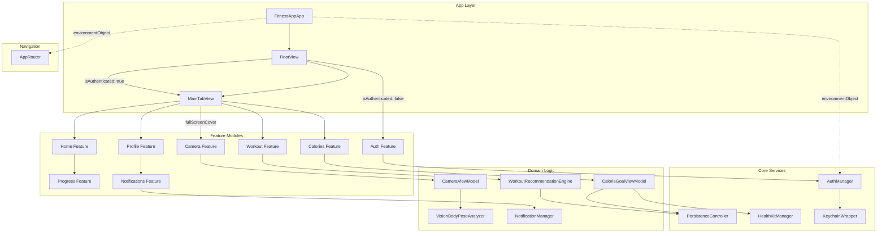
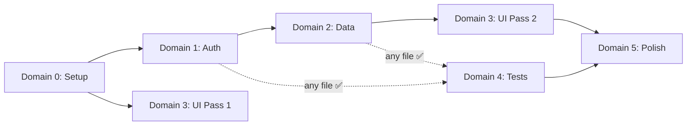
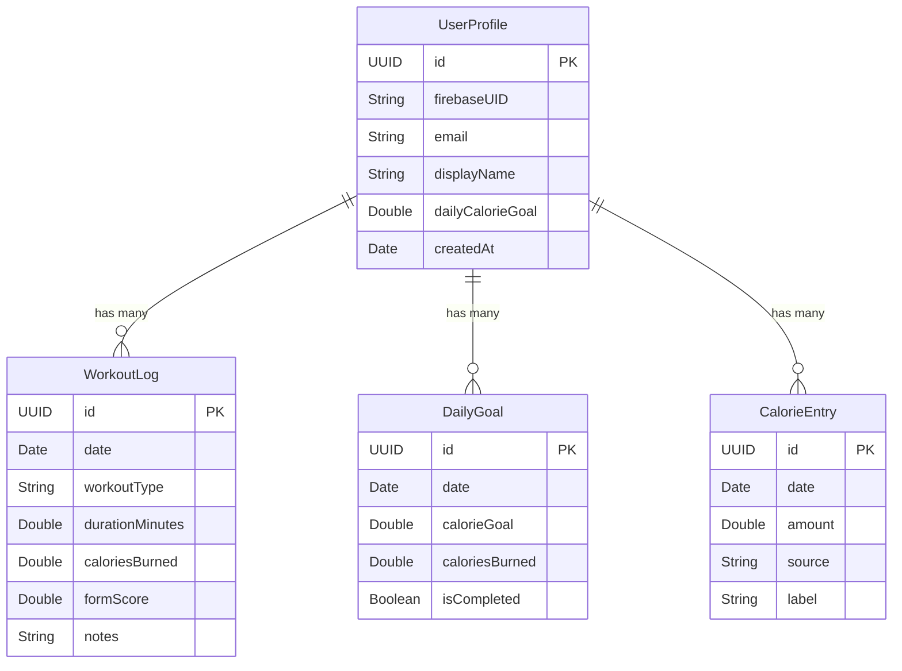
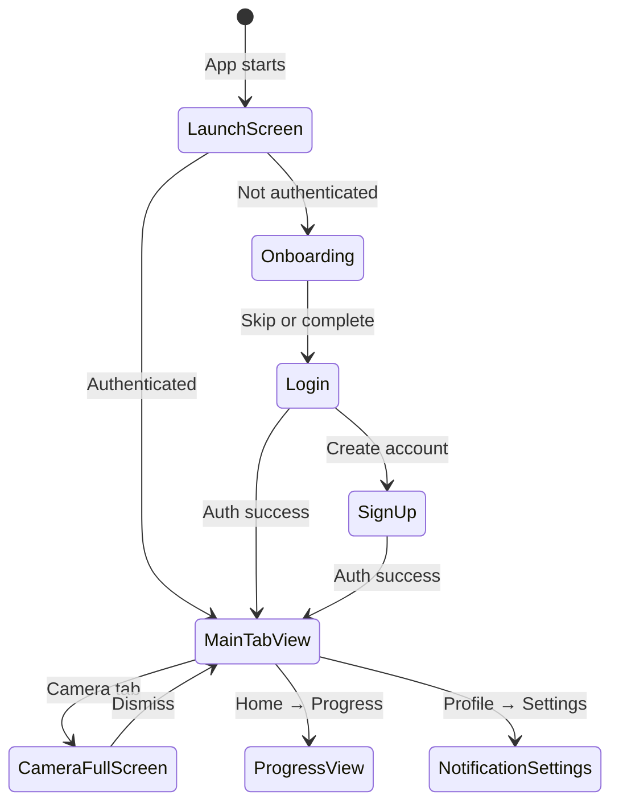
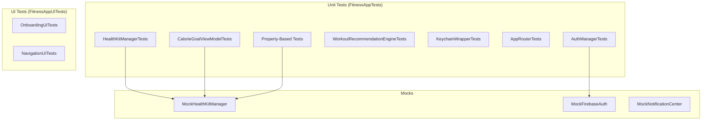

# Design Document: FitnessApp Orchestrated Build

## Overview

This design describes the complete architecture for FitnessApp, an iOS fitness tracking application built with SwiftUI targeting iOS 16.4+. The app provides authentication (Firebase + Google Sign-In), workout tracking, calorie management, real-time body pose detection via the Vision framework, HealthKit integration, and progress visualization using Swift Charts.

The implementation is organized into six orchestrated domains (Setup, Auth, Data, UI, Tests, Polish) that follow a strict dependency order enabling parallel development by multiple agents. Each domain owns specific files and communicates state through a shared coordination board (`SHARED_STATE.md`).

### Key Design Decisions

| Decision | Rationale |
|----------|-----------|
| CoreData over SwiftData | SwiftData requires iOS 17; project targets iOS 16.4 |
| ObservableObject + @Published | @Observable macro requires iOS 17 |
| Singleton managers with DI via init | Testable with mocks while maintaining simple access patterns |
| NavigationStack (not NavigationView) | NavigationView is deprecated; NavigationStack available iOS 16+ |
| AVFoundation via UIViewRepresentable | Only permitted UIKit bridge per constraints |
| XCTest only | No third-party test frameworks allowed |
| Rule-based recommendations | No ML dependency; deterministic and testable |

## Architecture

### System Architecture Diagram



### Domain Dependency Order



### Architectural Layers

1. **App Layer** — Entry point, Firebase configuration, environment injection
2. **Navigation Layer** — AppRouter managing tab state, sheets, deep links
3. **Feature Layer** — Self-contained feature modules (View + ViewModel pairs)
4. **Core Services Layer** — Singletons providing auth, persistence, health data
5. **Domain Logic Layer** — Pure business logic (recommendation engine, pose analysis)

### Threading Model

- All `@Published` properties live on `@MainActor` (class-level annotation)
- AVFoundation camera output uses a dedicated serial `DispatchQueue`
- Vision pose analysis runs on the camera queue, dispatches results to main
- CoreData viewContext accessed only from main thread; background work uses `performBackgroundTask`

## Components and Interfaces

### AppRouter

```swift
@MainActor
final class AppRouter: ObservableObject {
    @Published var selectedTab: AppTab = .home
    @Published var showOnboarding: Bool = true
    @Published var showCamera: Bool = false
    @Published var previousTab: AppTab = .home

    enum AppTab: String, CaseIterable {
        case home, workout, camera, calories, profile
    }

    func handleDeepLink(_ url: URL) { /* parse tab from URL, update selectedTab */ }
    func openCamera() { previousTab = selectedTab; showCamera = true }
    func dismissCamera() { showCamera = false; selectedTab = previousTab }
}
```

**Injected as:** `@StateObject` in `FitnessAppApp`, passed via `.environmentObject()`

### AuthManager

```swift
@MainActor
final class AuthManager: ObservableObject {
    static let shared = AuthManager()

    @Published var isAuthenticated: Bool = false
    @Published var currentUserID: String?
    @Published var errorMessage: String?
    @Published var isLoading: Bool = false

    private var authStateHandle: AuthStateDidChangeListenerHandle?

    func signIn(email: String, password: String) async
    func signUp(email: String, password: String) async
    func signInWithGoogle() async
    func signOut()
    func restoreSession()  // Called on launch to check persisted Firebase session
}
```

**Injected as:** `@StateObject` in `FitnessAppApp`, passed via `.environmentObject()`
**Singleton access:** `AuthManager.shared` for non-view contexts

### PersistenceController

```swift
final class PersistenceController {
    static let shared = PersistenceController()
    static var preview: PersistenceController { PersistenceController(inMemory: true) }

    let container: NSPersistentContainer

    init(inMemory: Bool = false)
    func save()
    func newBackgroundContext() -> NSManagedObjectContext
}
```

**Configuration:**
- Production: persistent store at default CoreData location
- Testing/Preview: `/dev/null` in-memory store
- `viewContext.automaticallyMergesChangesFromParent = true`
- `viewContext.mergePolicy = NSMergeByPropertyObjectTrumpMergePolicy`

### HealthKitManager

```swift
@MainActor
final class HealthKitManager: ObservableObject {
    static let shared = HealthKitManager()

    @Published var activeEnergyBurned: Double = 0

    func requestAuthorization() async throws
    func fetchTodayActiveEnergy() async throws -> Double
}
```

**Error types:** `HealthKitError.notAvailable`, `.unauthorized`, `.queryFailed(Error)`
**Simulator:** Returns mock value (320.0 kcal) via `#if targetEnvironment(simulator)`

### CameraViewModel

```swift
@MainActor
final class CameraViewModel: ObservableObject {
    @Published var isAuthorized: Bool = false
    @Published var isRunning: Bool = false
    @Published var detectedPose: VNHumanBodyPoseObservation?

    let session: AVCaptureSession
    private let poseAnalyzer: VisionBodyPoseAnalyzer
    private let queue: DispatchQueue

    func requestPermission() async
    func setupSession()
    func startSession()
    func stopSession()
}
```

**Lifecycle:** `setupSession()` → `startSession()` on appear; `stopSession()` on dismiss.

### VisionBodyPoseAnalyzer

```swift
final class VisionBodyPoseAnalyzer: NSObject, AVCaptureVideoDataOutputSampleBufferDelegate {
    var onPoseDetected: ((VNHumanBodyPoseObservation) -> Void)?
    private var frameCount: Int = 0

    func captureOutput(_:didOutput:from:)  // Processes every 4th frame
}
```

**Performance:** Skips 3 of every 4 frames. Confidence threshold: 0.5 for joint display.

### CalorieGoalViewModel

```swift
@MainActor
final class CalorieGoalViewModel: ObservableObject {
    @Published var dailyGoal: Double = 2000  // Range: 500–10,000
    @Published var consumed: Double = 0
    @Published var burned: Double = 0
    @Published var errorMessage: String?
    @Published var entries: [CalorieEntry] = []

    private let persistence: PersistenceController
    private let healthKitManager: HealthKitManager

    init(persistence: PersistenceController = .shared,
         healthKitManager: HealthKitManager = .shared)

    func loadTodayData() async
    func saveEntry(amount: Double, label: String) -> Result<Void, CalorieValidationError>
}

enum CalorieValidationError: LocalizedError {
    case invalidAmount
    case invalidLabel
    case persistenceFailed(Error)
}
```

### WorkoutRecommendationEngine

```swift
struct WorkoutRecommendationEngine {
    struct Recommendation {
        let workoutType: String
        let suggestedDurationMinutes: Double
    }

    func generateRecommendations(
        history: [WorkoutLog],
        remainingDeficit: Double,
        availableTypes: [String]
    ) -> [Recommendation]  // Returns 3–5 items
}
```

**Algorithm:**
1. Filter workout types completed in last 7 days → rank lower
2. Scale duration proportionally to remaining calorie deficit (max 60 min)
3. If no history → return 3 beginner workouts (≤20 min each)
4. If all types used recently → pick least-recently-performed first

### NotificationManager

```swift
@MainActor
final class NotificationManager: ObservableObject {
    @Published var workoutReminderEnabled: Bool = false
    @Published var goalReminderEnabled: Bool = false
    @Published var workoutReminderTime: Date  // Default 08:00
    @Published var goalReminderTime: Date     // Default 20:00
    @Published var permissionGranted: Bool = false

    func requestPermission() async
    func scheduleWorkoutReminder()
    func scheduleGoalReminder()
    func cancelReminders(category: ReminderCategory)
}

enum ReminderCategory {
    case workout, goal
}
```

### KeychainWrapper

```swift
struct KeychainWrapper {
    static func save(key: String, value: String) -> Bool
    static func load(key: String) -> String?
    static func delete(key: String) -> Bool
}
```

**Security:** Uses `kSecAttrAccessibleWhenUnlockedThisDeviceOnly`. Deletes before insert to handle updates.

## Data Models

### Entity Relationship Diagram



### Entity Details

#### UserProfile
| Attribute | Type | Constraints |
|-----------|------|-------------|
| id | UUID | Required, unique |
| firebaseUID | String | Max 128 chars, indexed |
| email | String | Max 254 chars |
| displayName | String? | Optional, max 100 chars |
| dailyCalorieGoal | Double | Default 2000 |
| createdAt | Date | Set on creation, immutable |

#### WorkoutLog
| Attribute | Type | Constraints |
|-----------|------|-------------|
| id | UUID | Required, unique |
| date | Date | Required |
| workoutType | String | Max 50 chars |
| durationMinutes | Double | Range 0.0–1440.0 |
| caloriesBurned | Double | Range 0.0–99999.0 |
| formScore | Double | Range 0.0–1.0 |
| notes | String? | Optional, max 500 chars |
| userProfile | Relationship | Many-to-one → UserProfile |

#### DailyGoal
| Attribute | Type | Constraints |
|-----------|------|-------------|
| id | UUID | Required, unique |
| date | Date | Required |
| calorieGoal | Double | Range 0.0–99999.0 |
| caloriesBurned | Double | Range 0.0–99999.0 |
| isCompleted | Boolean | Default false |
| userProfile | Relationship | Many-to-one → UserProfile |

#### CalorieEntry
| Attribute | Type | Constraints |
|-----------|------|-------------|
| id | UUID | Required, unique |
| date | Date | Required |
| amount | Double | Range 0.0–99999.0 |
| source | String | Constrained to "manual" or "healthkit" |
| label | String | Max 100 chars |
| userProfile | Relationship | Many-to-one → UserProfile |

### CoreData Extension Pattern

Each entity has a `+CoreData.swift` extension providing:
- `static func create(in:...) -> Entity` — factory with defaults
- Computed properties for type-safe access to optional attributes
- Fetch request helpers with common predicates (e.g., today's entries)

```swift
extension CalorieEntry {
    static func create(in context: NSManagedObjectContext,
                       amount: Double, label: String, source: String = "manual") -> CalorieEntry {
        let entry = CalorieEntry(context: context)
        entry.id = UUID()
        entry.date = Date()
        entry.amount = amount
        entry.label = label
        entry.source = source
        return entry
    }

    static func todayFetchRequest() -> NSFetchRequest<CalorieEntry> {
        let request = NSFetchRequest<CalorieEntry>(entityName: "CalorieEntry")
        let startOfDay = Calendar.current.startOfDay(for: Date())
        request.predicate = NSPredicate(format: "date >= %@", startOfDay as NSDate)
        request.sortDescriptors = [NSSortDescriptor(keyPath: \CalorieEntry.date, ascending: false)]
        return request
    }
}
```

### Navigation Architecture

#### Tab Structure

```swift
struct MainTabView: View {
    @EnvironmentObject var router: AppRouter

    var body: some View {
        TabView(selection: $router.selectedTab) {
            HomeView().tag(AppRouter.AppTab.home)
            WorkoutView().tag(AppRouter.AppTab.workout)
            Color.clear.tag(AppRouter.AppTab.camera)  // Placeholder; triggers fullScreenCover
            CalorieGoalView().tag(AppRouter.AppTab.calories)
            ProfileView().tag(AppRouter.AppTab.profile)
        }
        .fullScreenCover(isPresented: $router.showCamera) {
            CameraFeedView()
        }
        .onChange(of: router.selectedTab) { newValue in
            if newValue == .camera {
                router.openCamera()
            }
        }
    }
}
```

#### Deep Link Handling

URL scheme: `fitnessapp://tab/{tabName}`

```swift
func handleDeepLink(_ url: URL) {
    guard let host = url.host,
          let tab = AppTab(rawValue: host) else { return }
    selectedTab = tab
}
```

#### Navigation Flow



### Dependency Injection Strategy

```mermaid
graph TD
    APP[FitnessAppApp] -->|@StateObject| AUTH[AuthManager]
    APP -->|@StateObject| ROUTER[AppRouter]
    APP -->|.environmentObject| TREE[View Hierarchy]

    TREE -->|@EnvironmentObject| VIEWS[All Feature Views]

    VM_INIT[ViewModel Init] -->|Default param| SHARED[.shared singletons]
    VM_TEST[Test Init] -->|Injected mock| MOCK[Mock instances]
```

**Pattern:** Constructor injection with default parameters pointing to singletons.

```swift
// Production usage — uses defaults
let viewModel = CalorieGoalViewModel()

// Test usage — inject mocks
let viewModel = CalorieGoalViewModel(
    persistence: PersistenceController(inMemory: true),
    healthKitManager: MockHealthKitManager()
)
```

**Environment Objects (injected at root):**
- `AuthManager` — auth state for conditional rendering
- `AppRouter` — navigation state for tab/sheet control

**Singletons (accessed via .shared or init defaults):**
- `PersistenceController.shared`
- `HealthKitManager.shared`
- `NotificationManager` (created per-view as `@StateObject`)


## Correctness Properties

*A property is a characteristic or behavior that should hold true across all valid executions of a system — essentially, a formal statement about what the system should do. Properties serve as the bridge between human-readable specifications and machine-verifiable correctness guarantees.*

### Property 1: Camera dismiss restores previous tab

*For any* valid non-camera tab selection, opening the camera (via fullScreenCover) and then dismissing it should restore `selectedTab` to the value it held immediately before the camera was opened.

**Validates: Requirements 2.4**

### Property 2: Valid deep link sets correct tab

*For any* string that matches a valid `AppTab` raw value (home, workout, camera, calories, profile), handling a deep link URL containing that string should set `selectedTab` to the corresponding tab case.

**Validates: Requirements 2.6**

### Property 3: Invalid deep link preserves tab state

*For any* string that does NOT match a valid `AppTab` raw value, and *for any* current `selectedTab` state, handling a deep link URL with that invalid string should leave `selectedTab` unchanged.

**Validates: Requirements 2.7**

### Property 4: Auth failure preserves authentication state

*For any* Firebase error response during sign-in, the `errorMessage` property should be set to a non-nil localized description, and `isAuthenticated` should remain unchanged from its value before the call.

**Validates: Requirements 4.2**

### Property 5: Invalid credentials rejected on sign-up

*For any* password shorter than 6 characters OR *for any* email string missing "@" or a domain component, calling `signUp` should set `isAuthenticated` to false and set `errorMessage` to a non-nil value describing the validation failure.

**Validates: Requirements 5.3, 5.4**

### Property 6: Keychain CRUD round-trip

*For any* key-value string pair, saving to Keychain and then loading with the same key should return the original value. Furthermore, *for any* key that has been saved, deleting and then loading should return nil.

**Validates: Requirements 6.2, 6.3, 6.4**

### Property 7: CoreData entity persistence round-trip

*For any* valid attribute set conforming to entity constraints (UserProfile, WorkoutLog, DailyGoal, or CalorieEntry), creating the entity in a managed object context, saving, and then fetching by ID should return an entity with all attribute values equal to the originals.

**Validates: Requirements 8.4, 8.5, 8.6, 8.7**

### Property 8: Save is idempotent without changes

*For any* managed object context state where `hasChanges` is false, calling `save()` should perform no write operation and should not throw an error.

**Validates: Requirements 8.9**

### Property 9: Valid calorie entries persist successfully

*For any* calorie amount in the range [1, 99999] and *for any* label string of length [1, 100], calling `saveEntry` should succeed and the entry should be retrievable from CoreData with matching amount, label, source="manual", and today's date.

**Validates: Requirements 10.2**

### Property 10: Invalid calorie entries are rejected

*For any* calorie amount outside [1, 99999] OR *for any* label that is empty or exceeds 100 characters, calling `saveEntry` should return a validation error and should NOT create a CalorieEntry in CoreData.

**Validates: Requirements 10.3**

### Property 11: Consumed equals sum of today's entries

*For any* set of CalorieEntry records with dates within the current calendar day, the `consumed` property should equal the arithmetic sum of their `amount` values.

**Validates: Requirements 10.4**

### Property 12: Recommendation count invariant

*For any* combination of workout history, remaining calorie deficit, and available workout types (with at least 3 types available), the `generateRecommendations` function should return between 3 and 5 recommendations inclusive.

**Validates: Requirements 11.1**

### Property 13: Recent workout types ranked lower

*For any* workout history where type X was completed within the last 7 days and type Y was NOT completed within the last 7 days, type Y should appear at an equal or higher position (lower index) than type X in the recommendation list.

**Validates: Requirements 11.2**

### Property 14: Recommendation duration cap

*For any* positive remaining calorie deficit, all suggested workout durations in the recommendation list should be less than or equal to 60 minutes.

**Validates: Requirements 11.3**

### Property 15: Empty history produces beginner defaults

*For any* call to `generateRecommendations` with an empty workout history, the result should contain exactly 3 recommendations, each with a suggested duration of 20 minutes or less.

**Validates: Requirements 11.4**

### Property 16: Frame skip ratio

*For any* sequence of N video frames delivered to `VisionBodyPoseAnalyzer`, the number of frames on which `VNDetectHumanBodyPoseRequest` is executed should equal ⌊N/4⌋.

**Validates: Requirements 13.2**

### Property 17: Joint confidence threshold filter

*For any* set of detected body joint observations, only joints with a confidence value ≥ 0.5 should be included in the overlay point set passed to the view.

**Validates: Requirements 13.3**

## Error Handling

### Strategy Overview

All fallible operations use Swift's native error handling (`throws` / `async throws`) or `Result<T, Error>`. Errors are never silently discarded.

### Error Flow Pattern

```mermaid
graph TD
    OP[Async Operation] -->|throws| VM[ViewModel catch block]
    VM -->|sets| MSG[@Published errorMessage]
    MSG -->|drives| UI[Alert or inline error view]
    UI -->|user action| DISMISS[Clear errorMessage]
```

### Error Types by Domain

| Domain | Error Type | Cases |
|--------|-----------|-------|
| HealthKit | `HealthKitError` | `.notAvailable`, `.unauthorized`, `.queryFailed(Error)` |
| Auth | Firebase errors | Forwarded via `error.localizedDescription` |
| Calories | `CalorieValidationError` | `.invalidAmount`, `.invalidLabel`, `.persistenceFailed(Error)` |
| CoreData | System errors | Caught in `save()`, logged, errorMessage published |
| Camera | AVFoundation errors | Permission denied → UI state; session errors → logged |
| Keychain | Boolean returns | `false` = failure; no throwing |

### Error Handling Rules

1. **ViewModels** catch all errors and publish user-friendly messages via `@Published var errorMessage: String?`
2. **Services** (HealthKit, Auth) throw typed errors; never catch internally
3. **Persistence** logs errors via `print` in production; `fatalError` only in DEBUG for store load failure
4. **Camera** drops frames on Vision errors silently (frame loss is acceptable; crashes are not)
5. **Keychain** uses Boolean success/failure pattern (no throws)

### Graceful Degradation

| Failure | Behavior |
|---------|----------|
| HealthKit denied | App works with manual calorie entry; burned = 0 |
| Camera denied | Shows permission message + Settings button |
| Network unavailable | Auth shows error; cached data still accessible |
| CoreData save fails | Error published; UI state unchanged |
| Notification permission denied | Toggles disabled; Settings prompt shown |

## Testing Strategy

### Testing Framework

- **XCTest** exclusively (no third-party frameworks)
- **Property-based testing** using [SwiftCheck](https://github.com/typelift/SwiftCheck) for universal properties (minimum 100 iterations per property)
- **In-memory CoreData** for all data layer tests (`PersistenceController(inMemory: true)`)
- **Mocked HealthKit** — protocol-based abstraction for testability

### Test Architecture



### Unit Test Coverage

| Component | Min Coverage | Key Test Cases |
|-----------|-------------|----------------|
| AuthManager | 80% | signIn success/failure, signUp success/failure, Google sign-in, signOut |
| HealthKitManager | 90% | authorization granted/denied, energy query success/failure |
| CalorieGoalViewModel | 80% | saveEntry valid/invalid, consumed computation, HealthKit integration |
| WorkoutRecommendationEngine | 90% | ranking, deficit scaling, empty history, all-recent types |
| PersistenceController | 90% | CRUD operations, in-memory config, save idempotence |
| AppRouter | 80% | tab selection, deep links, camera flow |
| KeychainWrapper | 90% | save/load/delete round-trips |

### Property-Based Tests

Each correctness property from this design maps to a single property-based test:

| Test | Property | Min Iterations |
|------|----------|---------------|
| `testCameraDismissRestoresTab` | Property 1 | 100 |
| `testValidDeepLinkSetsTab` | Property 2 | 100 |
| `testInvalidDeepLinkPreservesTab` | Property 3 | 100 |
| `testAuthFailurePreservesState` | Property 4 | 100 |
| `testInvalidCredentialsRejected` | Property 5 | 100 |
| `testKeychainRoundTrip` | Property 6 | 100 |
| `testCoreDataEntityRoundTrip` | Property 7 | 100 |
| `testSaveIdempotent` | Property 8 | 100 |
| `testValidCalorieEntryPersists` | Property 9 | 100 |
| `testInvalidCalorieEntryRejected` | Property 10 | 100 |
| `testConsumedEqualsSumOfEntries` | Property 11 | 100 |
| `testRecommendationCountInvariant` | Property 12 | 100 |
| `testRecentTypesRankedLower` | Property 13 | 100 |
| `testDurationCap60Minutes` | Property 14 | 100 |
| `testEmptyHistoryBeginnerDefaults` | Property 15 | 100 |
| `testFrameSkipRatio` | Property 16 | 100 |
| `testJointConfidenceFilter` | Property 17 | 100 |

**Tag format:** `// Feature: fitness-app-orchestrated-build, Property N: <property text>`

### Mocking Strategy

```swift
// Protocol for HealthKit testability
protocol HealthKitProviding {
    func requestAuthorization() async throws
    func fetchTodayActiveEnergy() async throws -> Double
}

// Mock implementation
class MockHealthKitManager: HealthKitProviding {
    var shouldThrow: HealthKitError?
    var mockEnergy: Double = 320.0

    func requestAuthorization() async throws {
        if let error = shouldThrow { throw error }
    }

    func fetchTodayActiveEnergy() async throws -> Double {
        if let error = shouldThrow { throw error }
        return mockEnergy
    }
}
```

### Test Independence

- Each test creates its own in-memory `NSManagedObjectContext`
- No shared mutable state between tests
- Tests do not depend on execution order
- Mock objects are freshly instantiated per test method
